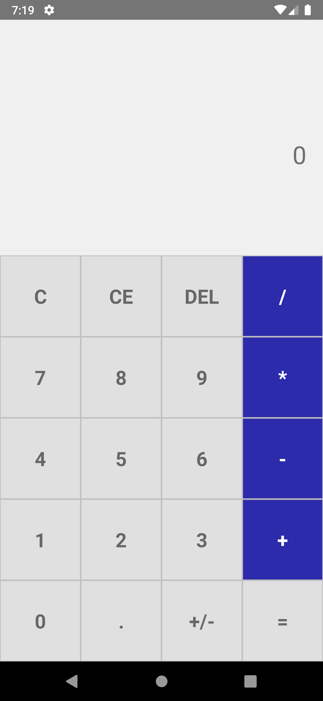

# React Native Project: Calculator Mobile Application

[](LICENSE)

## Description

This is a simple calculator. It is designed very simply with simple math methods and accurate ux.

## Table of Contents

- [Installation](#installation)
- [Screenshots](#screenshots)
- [Download APK](#download-apk)
- [Contact](#contact)

## Installation

This is a new [**React Native**](https://reactnative.dev) project, bootstrapped using [`@react-native-community/cli`](https://github.com/react-native-community/cli).

```bash
npm install
````

Run on android device
```bash
npm react-native run-android
````

## Screenshots

 <br>
*Caption for Screenshot 1.*

## Download APK

You can download the latest APK from the following link:

[Download v1.0 APK](https://github.com/shamodhaSahan/Calculator_Mobile_Application_React_Native/releases/tag/v1.0/calculator-app.apk
)

## Contact

For any questions, feedback, or concerns, feel free to reach out:

- **Email:** [shamodhasrathnamalala@gmail.com](mailto:shamodhasrathnamalala@gmail.com)
- **LinkedIn:** [Shamodha Rathnamalala](https://www.linkedin.com/in/shamodha-rathnamalala-21b079193/)
- **GitHub:** [Shamodha Sahan Rathnamalala](https://github.com/shamodhaSahan)


